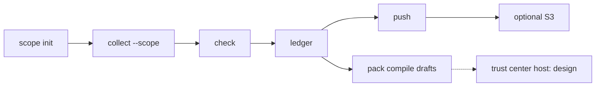

# Beacon

Beacon is a custody-first local evidence engine. You run the CLI or the TUI on your machine. An optional AWS lake stores sealed copies. Beacon is not a SaaS GRC product.

The control hub is the offline Secure Controls Framework (SCF) **2026.3** pin. A seal records collected bytes on a signed witness chain. A seal does not mean a control is met. The words compliant, evidenced, and proven need a linked judgment receipt and a passing `decide_claim` check.

**How it works:** [docs/HOW_IT_WORKS.md](docs/HOW_IT_WORKS.md)



1. `beacon scope init` writes the assessment boundary.
2. `beacon collect --scope` seals evidence and copies `scope_id` and `scope_sha256` into each payload.
3. `beacon check` fails closed on a missing checkpoint or a scope hash mismatch.
4. `beacon ledger summary` counts methods. Class C (at least 2) and Class D (at least 4) shortfalls are package gaps. They are not an authorization.
5. `beacon push` writes a local pack. With `BEACON_S3_BUCKET`, the lake stores sealed copies. Private keys stay in `.beacon/keys`.
6. `beacon pack compile` writes CPO, SDR, OCR, and SCG drafts. The official schema is not fetched. A hosted trust center is design. `BEACON_TRUST_CENTER_EXPORT=1` copies packs and reports only.

Package name: `beacon`. CLI name: `beacon`. Environment prefix: `BEACON_`. Data directory: `.beacon/`. MCP tools: `beacon_*`.

## Run

Python 3.10 or later is required.

```bash
python -m venv .venv
source .venv/bin/activate
pip install -e '.[dev]'
beacon init
beacon seed
beacon check
beacon serve
beacon tui
```

`beacon serve` starts the GUI (Dashboard, Freshness, Validation, Push, System).

`beacon tui` starts the Paramify-style terminal UI. The TUI adds a Collect screen. The first launch in a workspace opens a walkthrough. Press `?` or `h`, or the Tour button, to open it again. `?` still opens the tour when the target field is focused. `h` types into that field. `beacon tui --no-tour` and `BEACON_NO_TOUR=1` skip the auto-start. Skip and Done write `.beacon/tui_tour_seen`. The walkthrough is guidance. It does not add assurance.

## Collect

Without cloud credentials, inspectors seal **fixtures** through the witness chain. Live collection uses `aws`, `az`, and `gcloud`. A live failure is sealed as `live_failed`. It is never rewritten as a success fixture.

```bash
beacon collect --target IAC-02
beacon collect --target CRY-07
beacon collect --plugin aws.inspector
beacon collect --plugin aws.lake.logs
beacon collect --plugin aws.lake.logs --live
```

`--target IAC-02` and `--target CRY-07` select every loaded fetcher whose `FetcherSpec.scf_targets` overlap that control, then seal the results.

## AWS evidence lake

When `BEACON_S3_BUCKET` is set, collect and push dual-write sealed artifacts to S3 after the local seal. Remote keys keep raw observations under `observations/` and derived findings under `evidence/`. Packs go to `exports/packs/{pack_type}/{version}/`. DynamoDB `beacon-artifact-index` stores pointers, SHA-256 / input / audit hashes, `sealed_at`, and `expires_at` (24-hour freshness). Private keys (`*.pem`, `.beacon/keys`), `config.json`, and `cache/` are never uploaded. S3 server-side encryption uses KMS (SSE-KMS) on every object.

```bash
export BEACON_S3_BUCKET=...
export BEACON_KMS_KEY_ARN=...
export BEACON_DDB_TABLE=beacon-artifact-index
export BEACON_TENANT_ID=...
export BEACON_WORKSPACE_ID=...
export BEACON_LOGS_BUCKET=...
# optional: BEACON_S3_PREFIX, BEACON_OBJECT_LOCK_MODE, BEACON_OBJECT_LOCK_DAYS
# optional: BEACON_REQUIRE_REMOTE=1, BEACON_PACK_TYPE, BEACON_TRUST_CENTER_EXPORT=1
beacon collect --target IAC-02
beacon push
beacon sync
beacon pull
```

Create the bucket, KMS CMK (`alias/beacon-evidence`), table, and IAM roles with Terraform. Supported regions: `us-east-1` (commercial) and `us-gov-west-1` (GovCloud).

```bash
cd deploy/aws
terraform init
terraform apply
```

Prefer STS assume-role for `BeaconWriter` (Put/Get/List, no DeleteObject) and `BeaconAuditor` (read-only). See [docs/STORAGE.md](docs/STORAGE.md), [deploy/aws/README.md](deploy/aws/README.md), and [docs/architecture/beacon-evidence-lake.md](docs/architecture/beacon-evidence-lake.md).

OPA/Conftest checks for the Terraform controls:

```bash
make policy
# or:
conftest verify -p policy/terraform
conftest test --combine --parser hcl2 -p policy/terraform deploy/aws/*.tf
```

## Witness chain

- Recorder key and witness key are distinct Ed25519 keys.
- Each record carries both signatures and a previous-hash link.
- Checkpoints are SHA-256 Merkle roots timestamped with RFC 3161 (local TSA by default).
- `beacon check` **fails closed** with `E_NO_CHECKPOINT` when records are not covered by a checkpoint.

## SCF hub

Default API: `https://hackidle.github.io/scf-api/` (live host max 2026.1.1). That host is **not** the 2026.3 pin.

- Override base URL: `BEACON_SCF_API_BASE`
- Offline tests and air-gap: `BEACON_SCF_OFFLINE=1`
- Catalog pin directory: `BEACON_SCF_CATALOG_PATH` (default: `beacon/scf/catalog/`)

```bash
BEACON_SCF_OFFLINE=1 pytest
BEACON_SCF_OFFLINE=1 beacon collect --plugin scf.catalog.offline --fixture
```

See [docs/SCF_CATALOG.md](docs/SCF_CATALOG.md).

## Drop-in platforms

See [docs/PLUGINS.md](docs/PLUGINS.md). Example: [examples/echo_platform.py](examples/echo_platform.py).

```bash
export BEACON_PLUGIN_PATH=./examples/echo_platform.py
beacon plugins
beacon collect --plugin echo
```

CRA Article 14 early-warning evidence (KEV as a signal, not product exploitation):

```bash
export BEACON_PLUGIN_PATH=./examples/cra_art14_early_warning.py
beacon collect --plugin cra.art14.early_warning --fixture
```

See [docs/CRA_ART14.md](docs/CRA_ART14.md).

## MCP

```bash
beacon mcp
```

Tools: `beacon_status`, `beacon_init`, `beacon_seed`, `beacon_check`, `beacon_collect`, `beacon_plugins`, `beacon_freshness`, `beacon_scf_lookup`, `beacon_push`, `beacon_validation`.

## Assessment scope

Beacon can describe one instance with an assessment scope document. The document names the boundary, the frameworks in play, the data classes, the exclusions, and the allowed evidence kinds. `beacon collect --scope <scope_id>` copies `scope_id` and `scope_sha256` into each sealed observation payload. `beacon check` reloads `.beacon/scopes/{scope_id}.json` and fails closed on a missing file or a hash mismatch. A record with no pair keeps the current check rules. `beacon push` copies that pair into the pack manifest. `BEACON_REQUIRE_SCOPE=1` makes a missing `--scope` on collect and check fail closed. `Record.v` stays 1. Jev (TypeSafe System One) can later judge candidates that Beacon code builds. Choice picks a candidate or returns no-match. Score reports coverage. Noul reports sufficiency. Beacon code keeps the thresholds and fails closed. Beacon shows a control as compliant, evidenced, or proven only when a judgment receipt is linked and the threshold check passes. Main already pins SCF 2026.3. This change does not re-vendor that pin. See [docs/architecture/assessment-scope-and-jev.md](docs/architecture/assessment-scope-and-jev.md).

```bash
beacon scope init --id prod-commercial
beacon collect --scope prod-commercial --target IAC-02
beacon check --scope prod-commercial
beacon push
```

The assurance stack is the path from that scope to a machine-readable package: a workshop draft, custody tags, a per-framework lens, an evidence ledger, pack compilers, a git policy bridge, and trust-center export. This change locks that design. It does not submit a FedRAMP package, host a trust center, or send mail. See [docs/architecture/beacon-assurance-stack.md](docs/architecture/beacon-assurance-stack.md).

`beacon ledger show` indexes local seals (or one pack) by SCF id, the scope pair when it is present, custody tags, and the seal digest. `beacon ledger summary` counts distinct automated evidence methods for Class C (at least 2) and Class D (at least 4). A shortfall is a package gap. It does not say a control is met. Unknown tag values fail closed. `Record.v` stays 1.

```bash
beacon ledger show --scope prod-commercial
beacon ledger summary --scope prod-commercial --class c
```

`beacon pack compile` writes CPO, SDR, OCR, and SCG drafts from those seals. The JSON file is the source. Markdown is rendered from that JSON. A method shortfall is a package gap. The command does not fetch a FedRAMP schema. See [beacon/assurance/README.md](beacon/assurance/README.md).

```bash
beacon pack compile --scope prod-commercial --class c
```

## Limits and sources

- [docs/HOW_IT_WORKS.md](docs/HOW_IT_WORKS.md) — custody path from scope to seal to ledger
- [docs/architecture/README.md](docs/architecture/README.md) — architecture note index
- [LIMITS.md](LIMITS.md) — what Beacon does not claim
- [docs/SOURCES.md](docs/SOURCES.md) — GRCEngClub inspectors and Paramify fetchers as shape references
- [docs/STORAGE.md](docs/STORAGE.md) — S3 evidence lake, DynamoDB index, IAM
- [docs/CRA_ART14.md](docs/CRA_ART14.md) — CRA Article 14 early-warning packer (signal vs exploitation)
- [docs/IMPROVEMENT_LOG.md](docs/IMPROVEMENT_LOG.md) — cycle log
