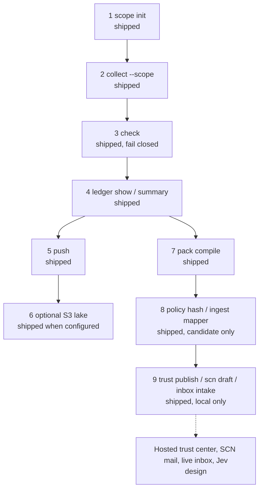

# How Beacon works

Read this page first. It is the custody path in plain language. The notes under [docs/architecture/](architecture/README.md) record decisions. They are not the start.

## What Beacon is

Beacon is a custody-first local evidence engine. You run it on your machine as a CLI or a TUI (`beacon tui`). An optional AWS lake stores sealed copies after the local seal. Beacon is not a SaaS GRC product. It does not file an audit opinion, a QSA assessment, or a FedRAMP 3PAO package. See [LIMITS.md](../LIMITS.md).

## A seal is not a compliance claim

A **seal** records that bytes were collected and chained. Two distinct Ed25519 keys sign each record. Each record links to the previous hash. Checkpoints store a SHA-256 Merkle root and an RFC 3161 timestamp. `beacon check` fails closed with `E_NO_CHECKPOINT` when a record has no checkpoint.

A **compliance claim** is a different statement. The words compliant, evidenced, and proven are claim words. Beacon may show one of those words only when `decide_claim` returns permitted and the same view shows the linked `receipt_id`. The receipt must match the scope hash, the evidence hash, and the receipt id. The default score minimum is 1.0. A seal does not pass that gate. A ledger shortfall of zero still does not permit a claim word. Jev (Choice, Score, Noul) may judge candidates in a later phase. Jev does not set the threshold. This repository has no live Jev client.

## The path



1. **Scope (shipped).** `beacon scope init --id prod-commercial` writes `.beacon/scopes/{scope_id}.json`. The file names the boundary, the frameworks, the data classes, the exclusions, and the allowed evidence kinds. `beacon scope hash` prints the canonical SHA-256 (`content_sha256()`).

2. **Collect (shipped).** `beacon collect --scope prod-commercial --target IAC-02` loads that file and copies `scope_id` and `scope_sha256` into each sealed observation payload. Without cloud credentials, collectors seal fixtures. A live CLI failure is sealed as `live_failed`. It is not rewritten as a success fixture. `BEACON_REQUIRE_SCOPE=1` makes a missing `--scope` fail closed. The default is off. A record with no scope pair keeps the current check rules.

3. **Check (shipped, fail closed).** `beacon check` reloads `.beacon/scopes/{scope_id}.json` when you pass `--scope` or when a payload already carries the pair. A missing file or a hash mismatch fails closed. A missing checkpoint fails closed. An unchecked chain is not verified evidence. AWS dual-write does not replace this check.

4. **Ledger (shipped).** `beacon ledger show` indexes local seals, or one pack file, by SCF id, the scope pair when the payload has it, custody tags, and the seal digest. `beacon ledger summary` counts distinct automated evidence methods. Class C needs at least 2. That figure cites CR26 guide rule FRC-CSX-VVK. Class D needs at least 4. The attached guide is Class C only. Beacon does not invent a Class D rule id. A shortfall is a package gap. It is not an authorization. The same method id counts once. A manual method is listed and does not count. An unknown tag value fails closed. The ledger does not emit a claim word.

5. **Push (shipped).** `beacon push` writes a local sealed pack under `.beacon/export/` (records, checkpoints, and public keys) plus Markdown. The pack manifest copies the scope pair from the sealed payload. It does not replace that pair with a different scope. Private keys stay out of the pack.

6. **Optional S3 lake (shipped when configured).** When `BEACON_S3_BUCKET` is set, collect and push dual-write sealed artifacts after the local seal. Raw observations stay under `observations/`. Findings stay under `evidence/`. Packs go to `exports/packs/{pack_type}/{version}/`. DynamoDB `beacon-artifact-index` stores pointers and hashes. The lake stores sealed bytes. It does not prove that the observation content is true. Supported deploy regions are `us-east-1` and `us-gov-west-1`.

7. **Pack compile (shipped).** `beacon pack compile` writes offline CPO, SDR, OCR, and SCG JSON drafts (`beacon-20x-draft/v1`) and Markdown from sealed observations and the Class C/D method counts. Shortfalls are `package_gaps`. Official CR26 schemas are `not-fetched`. The draft does not set a schema status word. This is not a FedRAMP submission. The field map is in [beacon/assurance/README.md](../beacon/assurance/README.md).

8. **Git policy (shipped as custody metadata).** `beacon policy show` and `beacon policy hash` address a JSON policy by path and canonical content hash. The tag is `evidence:policy`. Word and PDF files fail closed. `beacon ingest mapper` writes a candidate under `.beacon/ingest/mapper/` for a known mapper JSON shape. An unknown shape fails closed. The candidate role is `candidate`. It has no claim word. A witness seal of the git tip is still later. `Record.v` stays 1.

9. **Trust center, SCN, and inbox (shipped as local custody).** `beacon trust publish` writes allowlisted pack and report copies under `.beacon/export/trust-center/`. Set `BEACON_TRUST_CENTER_EXPORT=1` or the command fails closed. The same flag still copies pack and report objects to the lake prefix `public/trust-center/` when `BEACON_S3_BUCKET` is set. Raw observations, scope files, and paths outside the allowlist fail closed. No public host is required. `beacon scn draft` writes a significant-change object from seals and package gaps. `--dry-run` prints the object and does not write a file. The object is not mailed. `beacon inbox intake` reads a local JSON file, digests each known message, and writes a candidate under `.beacon/ingest/inbox/`. An unknown shape fails closed. Beacon does not open a mailbox and does not read mailbox credentials. A hosted trust center, SCN mail, and a live inbox poll stay design. A workshop UI, a live Jev client, and a witness seal of the policy tip stay design.

```bash
beacon scope init --id prod-commercial
beacon collect --scope prod-commercial --target IAC-02
beacon check --scope prod-commercial
beacon ledger summary --scope prod-commercial --class c
beacon push
beacon pack compile --scope prod-commercial --class c
beacon policy hash --path policies/access-control.json
beacon ingest mapper --file maps/report.json
BEACON_TRUST_CENTER_EXPORT=1 beacon trust publish --ledger
beacon scn draft --dry-run
beacon inbox intake --file inbox.json
```

## Where data lives

The workspace directory is `.beacon/`. Set `BEACON_HOME` or `BEACON_DATA_DIR` to use another path.

| Path | Contents |
| --- | --- |
| `.beacon/keys/` | Recorder key, witness key, and local TSA material. Never uploaded. |
| `.beacon/config.json` | Workspace metadata. Never uploaded. |
| `.beacon/chain/records.jsonl` | Witness records. |
| `.beacon/chain/checkpoints.jsonl` | Merkle roots and RFC 3161 tokens. |
| `.beacon/evidence/` | Sealed observation files. |
| `.beacon/scopes/{scope_id}.json` | Assessment scope document. |
| `.beacon/export/` | Local packs, 20x drafts, the trust-center tree, and SCN drafts. |
| `.beacon/ingest/mapper/` | Mapper candidate registrations. A candidate is not a witness seal. |
| `.beacon/ingest/inbox/` | Local security-inbox candidates. A candidate is not a mailbox reply. |
| `.beacon/cache/` | SCF API cache. Never uploaded. |

Packs include public keys only. `*.pem` private keys stay in `.beacon/keys/`. `BEACON_TENANT_ID` and `BEACON_WORKSPACE_ID` partition the lake. They are not the assessment `scope_id`.

## SCF is the hub

The control hub is the offline SCF **2026.3** pin in `beacon/scf/catalog/`. The pin stores counts, family rows, 270 mapped crosswalk framework ids, and the workbook SHA-256. It does not vendor `controls.json` or licensed control prose.

The default live API is `https://hackidle.github.io/scf-api/`. That host max is 2026.1.1. The live host is not the 2026.3 pin. The README SCF hub section and [SCF_CATALOG.md](SCF_CATALOG.md) say the same thing.

- `BEACON_SCF_API_BASE` overrides the live base URL.
- `BEACON_SCF_OFFLINE=1` uses the offline path and does not treat the live host as the pin.
- `BEACON_SCF_CATALOG_PATH` points at another pin directory. The default is `beacon/scf/catalog/`.

The offline control slice for `--target` is IAC-02 and CRY-07 only. The 2026.3 legacy map sends IAC-01 (IAM) to IAC-02 and CRY-05 (data at rest) to CRY-07. The 2026.3 ids IAC-01 and CRY-05 name different controls. The catalog plugin target is GOV-02.

## Read next

This page does not copy those notes.

- [Assessment scope and Jev](architecture/assessment-scope-and-jev.md) — scope document, hash bind, and the receipt gate.
- [Assurance stack](architecture/beacon-assurance-stack.md) — workshop, tags, ledger, pack compilers, git policy, and trust center, with each phase labeled.
- [Evidence lake](architecture/beacon-evidence-lake.md) — local seal, then optional S3 and DynamoDB.
- [LIMITS.md](../LIMITS.md) — bounds on what a seal, a ledger count, and a lake object mean.
- [SCF catalog pin](SCF_CATALOG.md) — 2026.3 pin files and fail-closed checks.
- [Storage](STORAGE.md) — object keys and the files that stay local.
- [20x pack drafts](../beacon/assurance/README.md) — field map for `beacon pack compile`.
