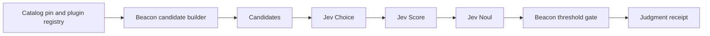

# Assessment scope and Jev evidence router

Status: design accepted. This change adds the schema stub only.
Date: 2026-09-24.

Main already pins SCF 2026.3. This document does not change `beacon/scf/catalog/PIN.json` and does not vendor `controls.json`. It does not invent SCF control ids. Example ids follow the 2026.3 workbook Legacy SCF # map: IAC-01 (IAM) is IAC-02, CRY-05 (Encrypting Data At Rest) is CRY-07, and GOV-01 (SCRP) is GOV-02. The 2026.3 ids IAC-01, CRY-05, and GOV-01 name different controls. When a later pin renumbers a control, cite the legacy map that ships with that pin. An operator writes a new scope document when the pin changes.

## Problem

Beacon seals observations and findings for one workspace. The seal shows that the bytes were recorded and chained. Operators also need a per-instance boundary: which accounts, regions, systems, frameworks, and evidence kinds that instance may use. Jev (TypeSafe System One: Choice, Score, and Noul) can judge which candidate evidence fits a control inside that boundary. Jev does not choose the candidates, and Jev does not set the pass threshold.

## Decision

Beacon stores an assessment scope document per instance. Every later collect, seal, and push carries `scope_id` and the canonical SHA-256 of that document. Beacon code builds candidate evidence from the catalog pin and the plugin registry, then asks Jev to judge those candidates. Beacon code applies thresholds and fails closed. A positive claim requires a linked judgment receipt.

`scope_id` is the assessment document id. `BEACON_TENANT_ID` and `BEACON_WORKSPACE_ID` remain the lake partition ids. `validate_scope_id` in `beacon/storage/s3.py` checks those partition ids. It does not parse an assessment scope.

## Scope document

Schema stub: `beacon/scope/document.py` (`ScopeDocument`). Schema version is `1`. The canonical hash is `content_sha256()` (sorted-key JSON from `beacon/canonical.py`). The hash covers the document body. The document does not store its own hash.

| Field | Role |
| --- | --- |
| `scope_id` | Safe id (`A-Za-z0-9`, `.`, `_`, `-`). No path segments. |
| `catalog_pin_version` | Operator label for the pin this scope accepts. The stub records the label. It does not read or change the pin files. |
| `frameworks` | Framework ids in play. These are catalog crosswalk framework ids, for example `general-nist-800-53-r5-2` from the current pin's `pillar_framework_ids`. They are not SCF control ids. |
| `data_classes` | Operator labels for data in the boundary. An empty list means no data class is in scope. |
| `exclusions` | Items outside the boundary. `kind` is `account`, `subscription`, `project`, `region`, `system`, `evidence_kind`, or `framework`. Each entry has `value` and `reason`. |
| `allowed_evidence_kinds` | Closed set: `cloud_inspector`, `lake_log_extract`, `catalog_pin`, `drop_in`. |
| `boundary` | `accounts`, `subscriptions`, `projects`, `regions`, `systems`. At least one list must be non-empty. |

Evidence kinds name collector classes that already exist:

| Kind | Plugins |
| --- | --- |
| `cloud_inspector` | `aws.inspector`, `azure.inspector`, `gcp.inspector` |
| `lake_log_extract` | `aws.lake.logs` |
| `catalog_pin` | `scf.catalog.offline` |
| `drop_in` | Plugins loaded from `BEACON_PLUGIN_PATH` |

An empty boundary is invalid. An unknown field is invalid. The field names `compliant`, `evidenced`, and `proven` are not part of the schema.

Assessment regions are the operator's system boundary. They are independent of the evidence-lake deploy regions (`us-east-1`, `us-gov-west-1`).

Example (ids already used in this repository; the framework id is a pin pillar id):

```json
{
  "schema_version": 1,
  "scope_id": "prod-commercial",
  "catalog_pin_version": "2026.3",
  "frameworks": ["general-nist-800-53-r5-2"],
  "data_classes": ["security-log"],
  "exclusions": [
    {"kind": "region", "value": "eu-west-1", "reason": "outside this instance"}
  ],
  "allowed_evidence_kinds": ["cloud_inspector", "lake_log_extract"],
  "boundary": {
    "accounts": ["123456789012"],
    "subscriptions": [],
    "projects": [],
    "regions": ["us-east-1"],
    "systems": ["evidence-lake"]
  }
}
```

## Binding

Later collect, seal, and push copy this pair into the observation payload:

| Field | Value |
| --- | --- |
| `scope_id` | Document id |
| `scope_sha256` | `ScopeDocument.content_sha256()` for the document used in that run |

The observation payload is already the hashed body of a witness `Record` (`payload_sha256`). Putting the pair in the payload binds the seal to that scope without a chain-format change. `Record.v` stays `1` in the bind phase. A later chain migration can copy the pair onto the record. This change does not alter `Record`.

`beacon check` in the bind phase reloads `.beacon/scopes/{scope_id}.json`, recomputes the hash, and compares it to `scope_sha256` in the payload. A missing file or a mismatch fails closed. Records sealed before the bind phase have no pair. Check leaves those records on the current rules.

`beacon push` copies the same pair into the pack manifest. The pack does not rewrite a scope hash.

## Catalog, scope, and seal

Three records stay separate:

| Record | Question it answers | Where it lives now |
| --- | --- | --- |
| Catalog | Which controls and framework ids exist for the pinned SCF release | `beacon/scf/catalog/` and the offline slice `beacon/scf/offline/` |
| Scope | Which boundary this instance may use | Schema stub only, in `beacon/scope/` |
| Seal | Which bytes were collected and chained | Witness `Record` plus local `evidence/{uuid}.json` |

A seal records collection. Collection statuses in current plugins stay `collected`, `collected_partial`, `failed`, and `live_failed`. Those words describe the collector run. A statement that a control is met is a separate claim. That claim requires a linked judgment receipt and a passing threshold check in Beacon code.

The catalog plugin seals a pin check. That seal does not prove a control. `aws.lake.logs` already states that its finding does not assert that the control is met. Scope does not change that sentence.

Control references in a later candidate list come from `FetcherSpec.scf_targets` and from controls the catalog slice already contains (`IAC-02`, `CRY-07`, and the catalog plugin target `GOV-02`). Those ids are the 2026.3 Legacy SCF # maps of IAC-01 (IAM), CRY-05 (Encrypting Data At Rest), and GOV-01 (SCRP). `aws.lake.logs` seals IAC-02 only. A control id that the catalog slice does not contain fails closed in offline mode. This design does not create control ids.

## Jev evidence router

Jev is TypeSafe System One. The three judgments are Choice, Score, and Noul. Beacon owns the candidate list and the thresholds. Jev judges the list it is given.



Beacon builds each candidate from code:

| Candidate field | Source |
| --- | --- |
| `candidate_id` | Plugin name, for example `aws.inspector` |
| `evidence_kind` | One allowed kind on the scope |
| `control_ref` | A target the plugin already declares and the catalog slice contains |
| `shape_sha256` | Canonical hash of the evidence shape the plugin declares |

The builder drops a candidate when the evidence kind is excluded, the framework is not in `frameworks`, or the plugin target is outside the catalog slice. Jev does not add candidates.

Jev returns only these results:

| Judgment | Result | Jev does not |
| --- | --- | --- |
| Choice | `pick` one candidate, or `no_match` | Create a fetcher or a control id |
| Score | `coverage` from 0 through 1 under the scope | Set pass or fail |
| Noul | `sufficient`, `insufficient`, or `abstain` | Emit a compliance word |

Thresholds live in Beacon. The stub constant `DEFAULT_SCORE_MIN` is `1.0`. Coverage must be greater than or equal to that minimum. A later phase may store a lower operator minimum in Beacon configuration. Jev does not receive the minimum and does not return a permitted flag.

The code gate is `decide_claim`. It returns `permitted` false unless all of the following are true:

1. A `JudgmentReceipt` is present.
2. The caller passes the scope hash, the evidence hash, and the receipt id from the seal.
3. Those hashes equal `scope_sha256` and `evidence_sha256` on the receipt, and the receipt id equals `receipt_id` on the receipt.
4. Choice is `pick` and names `candidate_id` plus `candidate_sha256`.
5. Noul is `sufficient`.
6. Score coverage is greater than or equal to the Beacon minimum.

Any other result stays a machine reason: `missing_receipt`, `unbound_scope`, `unbound_evidence`, `unbound_receipt`, `scope_hash_mismatch`, `evidence_hash_mismatch`, `receipt_id_mismatch`, `choice_no_match`, `missing_candidate`, `noul_abstain`, `noul_insufficient`, or `score_below_min`. The reason list has no claim word.

## Claim words

The words compliant, evidenced, and proven are claim words. Beacon may show a claim word only when `decide_claim` returns `permitted` true and the same view shows `receipt_id`. The schema stub does not print those words. `decide_claim` does not return them.

A receipt is linked when the sealed payload stores `scope_id`, `scope_sha256`, and `receipt_id`, and the receipt hashes and receipt id match that payload and the scope file. A receipt file alone is not a link. `decide_claim` requires the caller to pass both expected hashes and the expected receipt id for that reason. A different receipt with the same hashes stays `receipt_id_mismatch`.

## Storage

This change does not write these paths. Later phases use them.

Local workspace (next to today's `.beacon/` layout):

```
.beacon/scopes/{scope_id}.json
.beacon/receipts/{receipt_id}.json
```

The scope file is the hashed document. It is not `config.json`. `config.json` stays local and stays off the lake. Scope files and receipt files contain no cloud credentials and no private keys.

Lake objects, after the local seal, use the current prefix and partition:

```
{prefix/}{tenant_id}/{workspace_id}/scopes/{scope_id}.json
{prefix/}{tenant_id}/{workspace_id}/receipts/{receipt_id}.json
```

SSE-KMS, Object Lock, and the writer and auditor roles stay as they are. `public/trust-center/` does not receive scope documents or receipts.

DynamoDB `beacon-artifact-index` gains these items in the lake phase:

| Sort key | Fields |
| --- | --- |
| `SCOPE#{scope_id}` | `s3_uri`, `scope_sha256`, `catalog_pin_version` |
| `RECEIPT#{receipt_id}` | `s3_uri`, `scope_id`, `scope_sha256`, `evidence_sha256`, `receipt_sha256` |
| `EVIDENCE#{evidence_id}` | Existing fields, plus `scope_id`, `scope_sha256`, `receipt_id` when a bind exists |

Empty scope fields on older `EVIDENCE#` items mean the record has no assessment bind. They do not mean the control passed.

## CLI sketch

This change does not add commands. The later CLI is:

```bash
beacon scope init --id prod-commercial
beacon scope show --id prod-commercial
beacon scope hash --id prod-commercial
beacon collect --scope prod-commercial --target IAC-02
beacon check --scope prod-commercial
```

`scope hash` prints the canonical SHA-256. An unknown `scope_id` fails closed. Until the require-scope phase, `collect` and `check` without `--scope` keep today's behavior. With `--scope`, a missing or mismatched document fails closed. A later phase can set `BEACON_REQUIRE_SCOPE=1` so a missing flag also fails closed.

`beacon push` uses the scope id already stored on the sealed payloads. It does not take a different scope than the one that was sealed.

## Non-goals

This design leaves the following work out:

- A full GRC workflow (assignments, an auditor portal, or upload to Paramify or another GRC product)
- A successful seal that marks a control as met
- New SCF control ids, legacy maps, or crosswalk rows
- A change to the SCF catalog pin. Main already pins 2026.3. This design does not re-vendor `controls.json` or invent control ids.
- A live Jev network client
- A witness `Record` version change
- Writing scope files from `collect` in this change

## Phased build plan

| Phase | Work | Done in this change |
| --- | --- | --- |
| 0 | ADR, schema stub, round-trip tests, README and LIMITS pointer | Yes |
| 1 | `beacon scope init`, `show`, and `hash`. Persist `.beacon/scopes/{scope_id}.json`. Unknown id fails closed. | No |
| 2 | Bind. `collect` and `push` copy `scope_id` and `scope_sha256` into the observation payload when `--scope` is set. `check` recomputes the hash. Mismatch fails closed. `Record.v` stays 1. | Yes. `BEACON_REQUIRE_SCOPE=1` is optional and fails closed when `--scope` is missing. |
| 3 | Candidate builder. Pure function over loaded plugins, catalog targets, and the scope. Tests use existing plugin ids and existing targets (`IAC-02`, `CRY-07`). A target absent from the offline slice fails closed. Resolve framework ids against the pin. Reject ids the pin lists in `not_a_framework_id`. | No |
| 4 | Jev adapter behind a small protocol: `choice`, `score`, `noul`. Tests use a local fake judge. No network. Write `JudgmentReceipt` files. Call `decide_claim` with `DEFAULT_SCORE_MIN` unless operator config sets a lower minimum. | No |
| 5 | Lake objects and index fields for `SCOPE#` and `RECEIPT#`, plus optional fields on `EVIDENCE#`. Same SSE-KMS rules. Trust-center prefix stays closed to these objects. | No |
| 6 | GUI, TUI, and MCP show the scope hash and the receipt id. A claim word appears only beside that receipt id when `decide_claim` permits it. | No |

Follow-up work is phase 1 through phase 6. Phase 0 is the review surface for those phases.
