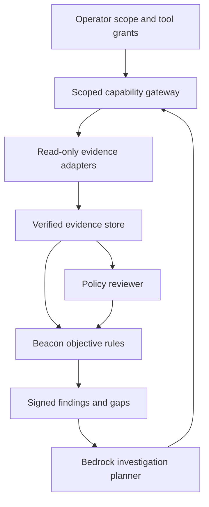

# AWS agentic evaluation: implementation and expansion plan

Status: the Bedrock advisory adapter and scoped local MCP tools are implemented.
A hosted agent loop, AgentCore Gateway, autonomous remediation, and live model
validation are not deployed by this change.

Use Bedrock as the preferred AWS inference path, behind a provider interface.
Keep collection adapters, deterministic objective rules, and signed receipts
independent of the model provider. Jev remains an optional separate provider;
its probability primitives and Bedrock's text classifications have distinct
contracts. An AWS deployment does not require a managed autonomous agent service.

The planner/gateway loop in this diagram is the next deployment stage. The
present policy reviewer receives no tools; model output cannot invoke AWS,
modify scope, choose acceptance thresholds, or authorize remediation.

## Add capabilities by assessment need

| Stage | Connections | Permission and output boundary |
| --- | --- | --- |
| Implemented | EBS DescribeVolumes + STS; exact Git policy commits; current legacy collectors | Explicit scoped collection; failed/partial attempts remain visible |
| Next | AWS Config inventory/history, Security Hub findings, CloudTrail lookup, IAM credential reports, KMS metadata | Read-only roles per account and region; typed pagination/freshness manifests; service-specific rules |
| Next | GitHub policy/PR history and Terraform plan artifacts | Pinned commits, verified source identity, bounded path/content allowlists |
| Later | Ticketing, CMDB, ownership records, approved policy stores | Separate connectors and credentials; provenance and collection completeness per source |
| Later | Targeted follow-up collection and remediation drafts | Allowlisted tool schemas; fixed assessment scope; budgets and bounded loops |
| Separate rollout | Approved resource changes | Separate execution role; reviewed plan; explicit approval and idempotent, auditable change handling |

Do not equate many tool registrations with usable coverage. Each adapter needs
negative tests, source identity, failure behavior, pagination or completeness
rules, freshness, scope constraints, and an objective rule that says exactly what
it can demonstrate. Add schema-versioned manifests rather than accepting arbitrary
JSON labeled `live`. Avoid one broad IAM role with access to every tentacle.

For an AWS-hosted loop, evaluate AgentCore Gateway to wrap Lambda/OpenAPI tools
and MCP services. Use IAM or OAuth for gateway authentication and policy rules
for tool invocations. Policy evaluation in AgentCore applies to MCP **tools**;
resource and prompt reads need their own access design. Keep assessment scope
checks inside Beacon even when a gateway authorizes a call. Split model invocation,
read-only collection, evidence writing, and remediation permissions.

Start orchestration with a small bounded state machine: select an approved
objective, inspect its current gaps, request an allowed collection, evaluate,
then stop or request human review. Cap call count, tokens, elapsed time, and cost.
Deduplicate collection requests and record why each tool was used. Step Functions
or a small application loop can supply orchestration; choose AgentCore Runtime
when managed agent hosting and identity meet the deployment's requirements.

Use a benchmark before selecting production models: known encrypted/unencrypted
assets, access-denied pages, stale evidence, incomplete policies, contradictory
records, prompt injection in documents, wrong-scope identities, and fabricated
citations. Measure false support, abstention, citation validity, latency, and cost.
Bedrock model-evaluation jobs can help compare response quality. They do not
supply Beacon's SCF control rules or create a compliance opinion.

## Deployment decisions still required

Select model/model version and compatible Converse features; choose account,
commercial/GovCloud partition, region, and permitted inference routing; establish
least-privilege roles and model access; configure log retention and redaction;
review data allowed in model prompts; provision TLS/operator identity; and retain
signer pins/continuity anchors independently. Exact model and AgentCore feature
availability must be checked in the chosen partition/region. No live AWS or model
calls are required by tests or CI, and no account resources are provisioned here.

## Primary references

- [Bedrock Converse API](https://docs.aws.amazon.com/bedrock/latest/APIReference/API_runtime_Converse.html)
- [AgentCore Gateway](https://docs.aws.amazon.com/bedrock-agentcore/latest/devguide/gateway.html)
- [Gateway tool policy](https://docs.aws.amazon.com/bedrock-agentcore/latest/devguide/use-gateway-with-policy.html)
- [Bedrock model-as-judge evaluation](https://docs.aws.amazon.com/bedrock/latest/userguide/evaluation-judge.html)
- [EC2 DescribeVolumes pagination](https://docs.aws.amazon.com/boto3/latest/reference/services/ec2/paginator/DescribeVolumes.html)

## Memory and workspaces

See [Hindsight and execution workspaces](agent-memory-and-workspaces.md) for the
proposed memory loop, source provenance, tenant isolation, AWS deployment shape,
and a Cloudflare Computer prototype boundary. These integrations are proposed,
not connected services.

## Existing parallel work

PR #2's React/Node assurance workspace remains a separate product branch. This
change develops the Python engine and its existing interfaces; it does not merge
or replace that application. Port any useful presentation work only after it
calls the verified engine. PR #5's older 2026.2 catalog work must be reconciled
against the current 2026.3 pin, not merged as a silent catalog downgrade.
