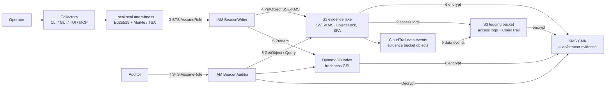

# Beacon evidence lake architecture

This diagram is the **current** platform build: Beacon collectors, local seal/witness, then dual-write to the AWS evidence lake.
Sources: `deploy/aws/*.tf`, `beacon/storage/s3.py`, `beacon/crypto/witness.py`, [STORAGE.md](../STORAGE.md).

Open the AWS-style drawing in [beacon-evidence-lake.drawio](beacon-evidence-lake.drawio).

## Mermaid data flow



## Legend of data-flow steps

| Step | What happens | Where it lives |
| --- | --- | --- |
| 1 | Inspectors collect evidence. Live CLIs are `aws`, `az`, and `gcloud`. Offline mode seals fixtures. A live failure is sealed as `live_failed`. | `beacon collect`, plugins under `beacon/plugins` |
| 2 | Local seal runs first. Recorder and witness Ed25519 keys sign each record. Checkpoints store a SHA-256 Merkle root with an RFC 3161 TSA token. `beacon check` fails closed (`E_NO_CHECKPOINT`) when coverage is missing. | `beacon/crypto/witness.py` |
| 3 | The collector process assumes `BeaconWriter` with STS. An instance profile is optional. Do not put long-lived keys in Beacon env. | `deploy/aws/iam.tf` |
| 4 | After the local seal, `ArtifactLake._put_bytes` writes objects under `{prefix/}{tenant}/{workspace}/`. Raw observations stay under `observations/`. Findings stay under `evidence/`. Chain files stay under `chain/`. Packs stay under `exports/packs/`. Every `PutObject` sets SSE-KMS, `beacon-class` tags, and Object Lock retain headers. | `beacon/storage/s3.py`, `deploy/aws/s3.tf` |
| 5 | The same write updates DynamoDB `beacon-artifact-index`. Partition key is `{tenant}#{workspace}`. Sort keys include `EVIDENCE#`, `CP#`, `FRESH#`, and `IMPORT#`. IAM `dynamodb:LeadingKeys` binds that partition. | `deploy/aws/dynamodb.tf` |
| 6 | Customer CMK `alias/beacon-evidence` encrypts S3 objects and the DynamoDB table. Automatic annual rotation is on. Writer may `Encrypt` / `GenerateDataKey`. Auditor may `Decrypt` only. | `deploy/aws/kms.tf` |
| 7 | An auditor assumes `BeaconAuditor` with STS. The role is Get/List/Query on the same prefix and partition. | `deploy/aws/iam.tf` |
| 8 | `beacon pull` downloads objects, verifies SHA-256 / input / audit hashes and the staged witness chain, then installs local files. Hash mismatch does not prove the original observation is true. See [LIMITS.md](../../LIMITS.md). | `beacon/storage/s3.py` `pull_workspace` |
| 9 | S3 server access logs and CloudTrail object-level data events land in a dedicated logging bucket. `aws.lake.logs` reads those objects and seals an observation plus a finding. Raw AWS files stay in the logging bucket. | `deploy/aws/logging.tf`, `beacon/plugins/lake_logs.py` |

## Object layout

```
{prefix/}{tenant_id}/{workspace_id}/observations/{uuid}.json
{prefix/}{tenant_id}/{workspace_id}/evidence/{uuid}.json
{prefix/}{tenant_id}/{workspace_id}/chain/records.jsonl
{prefix/}{tenant_id}/{workspace_id}/chain/checkpoints.jsonl
{prefix/}{tenant_id}/{workspace_id}/exports/packs/{pack_type}/{version}/
{prefix/}{tenant_id}/{workspace_id}/public/trust-center/   # pack/report copies only
```

`public/trust-center/` never holds raw observations. The writer and the bucket policy both deny those classes.

## AWS services in this build

This module does **not** create a VPC, Lambda, or API Gateway.
Collectors call regional AWS APIs after the local seal.

| Service | Role |
| --- | --- |
| IAM `BeaconWriter` | Put/Get/List and `PutObjectRetention` on the workspace prefix. Read-only List/Get on `s3-access-logs/` and `cloudtrail/` in the logging bucket. No `DeleteObject`. No `BypassGovernanceRetention`. |
| IAM `BeaconAuditor` | Read-only Get/List/Query on the same prefix. |
| KMS CMK | SSE-KMS for S3 and DynamoDB. Rotation enabled. |
| S3 | Evidence lake. Versioning, Object Lock, Block Public Access, BucketOwnerEnforced, lifecycle to STANDARD_IA / GLACIER. |
| S3 logging bucket | Dedicated destination for S3 access logs (`s3-access-logs/`) and CloudTrail data events (`cloudtrail/`). Same SSE-KMS / BPA / BucketOwnerEnforced. No Object Lock. |
| CloudTrail | Module-scoped data events on evidence-bucket objects (read and write). Management events are off. |
| DynamoDB | Artifact index plus `freshness` GSI. |

Supported deploy targets: **us-east-1** and **us-gov-west-1**. Set `var.aws_region`. Do not hard-code the region.

Compliance controls: [terraform-compliance.md](terraform-compliance.md).
