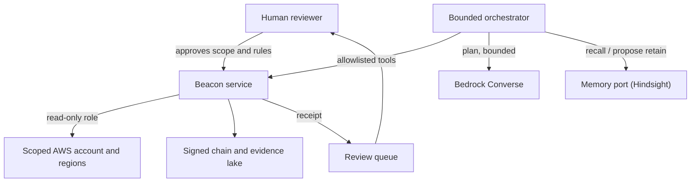

# Verified agent slice: integration design

Status: design only. Nothing in this document is connected or deployed. No AWS
resources, Hindsight bank, Bedrock deployment, AgentCore runtime, or Cloudflare
Computer workspace exist for Beacon. This document turns the proposals in
[agent memory and workspaces](agent-memory-and-workspaces.md) and
[AWS agentic evaluation](aws-agentic-evaluation.md) into explicit contracts. It
also defines the one vertical slice that must be stable before new collectors or
objective rules are added.

## 1. Status of each part

| Part | Status | Where |
| --- | --- | --- |
| Custody: signer pins, chain, Merkle/TSA checkpoints, retained head, locking | Implemented and tested | `beacon/crypto/*`, `beacon/locking.py` |
| Admission: verified snapshot and eligibility reasons | Implemented and tested | `beacon/assurance/admission.py` |
| Scope v2: boundary, exclusions (including framework), rule approval, expected population | Implemented and tested | `beacon/scope/*` |
| AWS EBS collector (STS + DescribeVolumes, bounded pages, partial failure) | Implemented and tested with stubs. Not run against a real account | `beacon/plugins/aws_ebs.py` |
| Deterministic rule `ebs-volume-encryption/v1` for `CRY-07_A02` | Implemented and tested | `beacon/assurance/evaluation.py` |
| Policy capture from an approved Git commit | Implemented and tested | `beacon/assurance/policy_capture.py` |
| Policy content rules (`GOV-02_A01`, `GOV-02_A21`, `IAC-02_A03`, `IAC-02_A05`) | Implemented and tested. The best result is `needs_review`, never `supporting_pass` | `beacon/assurance/evaluation.py` |
| Evaluation receipt (`beacon.evaluation/v2`), sealed and checkpointed | Implemented and tested | `beacon/assurance/evaluation.py` |
| Bedrock Converse advisory reviewer | Implemented and tested with stubs. No live model call | `beacon/assurance/bedrock.py` |
| Jev advisory judge | Implemented and tested with a mock transport. No live call | `beacon/assurance/jev.py` |
| CLI, web, TUI, MCP interfaces on the same engine | Implemented and tested | `beacon/cli.py`, `beacon/gui`, `beacon/tui`, `beacon/mcp` |
| SCF 2026.3 objective catalog (6446 rows, pinned digest `85bd3250…`) | Implemented and tested. Restored in `0230449` after a truncated commit | `beacon/scf/objectives/` |
| Human review record (`beacon.review/v1`) | Designed here. Not implemented | Section 6 |
| Agent run record (`beacon.agent-run/v1`) | Designed here. Not implemented | Section 5 |
| Memory port and Hindsight adapter | Designed here. Not implemented. Not connected | Section 4 |
| Bounded orchestrator (Step Functions or a small loop) | Designed here. Not implemented | Section 5 |
| AgentCore Gateway / Runtime | Proposed. Feature availability in the target partition and region is not verified | Section 5 |
| Cloudflare Computer sandbox adapter | Proposed. Upstream says preview only | Section 7 |
| More collectors and objective rules | Future work. Blocked by the slice exit gate | Section 9 |

## 2. Authority of evidence

"Authoritative" in Beacon means two things only: custody is verified, and the
record is eligible input for one narrow deterministic assertion. It is never a
compliance, control, objective, FedRAMP, CMMC, ISO, or SCF claim. The receipt
fields `objective_satisfied`, `control_satisfied`, and `assurance_claim` stay
`false` in every path.

| Class | What is in it | Can it change a receipt row? |
| --- | --- | --- |
| Authoritative input | A sealed record that passes `verified_snapshot` and has no `eligibility` reasons: live, complete, fresh, correct source and format, in the scope boundary, allowed kind, not excluded | Yes, but only through an approved deterministic rule. `supporting_pass` covers the rule's `assertion` text, not the objective |
| Custody-valid, not eligible | Fixtures, `live_failed`, incomplete, stale, future-dated, unbound, out-of-boundary, excluded, catalog references, earlier receipts | No. The row shows `ineligible` with each reason |
| Captured policy text | A `git.policy` record from an approved commit and file digest | No automatic result. It shows what the policy says, not that people follow it. The row ends at `needs_review` |
| Advisory | Jev and Bedrock judgments, planner output, Hindsight recall, sandbox output | No. They can order human review. They never set `supporting_pass` |
| Historical | Earlier evaluation receipts | No. They were correct at their time. Run `evaluate` again for a current result |
| Not evidence | Memory text without a source link, model reflections, synthetic test catalogs | Never |

Assumptions that limit custody:

- By default, a **workspace-local** TSA key signs checkpoint timestamps. These
  timestamps show order and integrity against that key. They do not show
  independent time. Configure an independent RFC 3161 TSA if independent time
  is necessary.
- The local retained head detects chain-only rollback. It does not detect the
  restore of a full workspace. That needs `BEACON_ANCHOR_DIR` under separate
  administration.
- A live collector runs with the operator's AWS credentials. Beacon checks the
  STS identity and regions against the scope, but it does not authenticate the
  collector host.

## 3. Separation of roles

| Component | It can | It must not |
| --- | --- | --- |
| Beacon service | Enforce scope, verify custody, run deterministic rules, seal receipts, hold signer keys | Accept memory or model text as a rule input |
| Bedrock / AgentCore | Plan a bounded investigation from the allowed tools. Write an advisory policy review | Change scope, rules, thresholds, or memory destination. Call AWS directly. Get signer keys or writer roles |
| Hindsight | Supply source-linked historical context. Keep provenance-bearing observations | Be read by `evaluate_control`, `eligibility`, or any sealing function |
| AWS connectors | Read-only collection in one scoped account and its scoped regions | Write, remediate, or collect outside the scope boundary |
| Human reviewer | Accept or reject advisory results, interpret policy, approve remediation plans | Be replaced by a model. Be identified by a model-supplied value |
| Cloudflare Computer (optional) | Run bounded jobs on read-only copies of sealed artifacts | Hold production credentials or signer keys. Write evidence or scope |

## 4. Memory integration (Hindsight)

### 4.1 Port

Beacon talks to memory only through one port. The Hindsight adapter is one
implementation. A fake in-memory adapter is the test implementation. These names
are proposed. They do not exist in the code yet.

```text
MemoryPort.recall(RecallRequest) -> RecallResult
MemoryPort.propose_retain(MemoryEvent) -> OutboxEntry
MemoryPort.status(operation_id) -> queued | completed | failed | unknown
```

`RecallRequest` fields: `scope_id`, `scope_sha256`, `control_ref`, `ao_ids`,
`query`, `max_output_tokens` (start at 2048), `as_of`. The service adds the
tenant and environment from its own authenticated configuration. The request
has no field for a bank, endpoint, or credential, so the model cannot select
one.

`RecallResult` has `status` (`ok`, `unavailable`, or `degraded`) and a list of
items. Each item has `memory_id`, `source_document_id`, `kind`, `event_time`,
`text`, and `sources` (evidence or receipt ids with SHA-256 digests). The
adapter removes each item that has no source link and counts it in
`dropped_without_provenance`.

### 4.2 What can be retained

The service writes a `MemoryEvent` only **after** `evaluate_control` returns a
sealed receipt, and only after `verified_snapshot` finds that receipt. Each
event must have:

- `kind`: `observed`, `operator_decision`, `collector_failure`, `procedure`,
  `proposal`, or `hypothesis`. The kind is also written into the text.
  Model-written text is only `proposal` or `hypothesis`.
- `receipt_evidence_id`, `receipt_sha256`, `scope_id`, `scope_sha256`, and
  `chain_head_sha256`.
- `ao_ids` and the source evidence ids with their digests.
- `event_time`, `recorded_at`, `actor` (from service authentication), and
  `expires_at`.
- A new `document_id` for each snapshot, so that an old snapshot is not replaced.
- A short narrative, limited to a fixed size.

Never retain credentials, raw payloads, full transcripts, private keys, or
personal data that has no relation to the assessment.

### 4.3 Retention

| Kind | Expiry |
| --- | --- |
| `observed` | The receipt row's `expires_at`, plus a configured history window |
| `operator_decision` | The decision's own expiry. If there is none, a required review date |
| `collector_failure`, `procedure` | A configured window, then a review |
| `proposal`, `hypothesis` | Short. They are not retained after the run unless a human accepts them |

A delete or correction names exact source records. It also removes derived
observations.

### 4.4 Rules

- **M1.** Recall output goes only to the planner prompt and to the human review
  view. No recall value is an argument to a rule, to `eligibility`, or to a seal.
- **M2.** Memory never overrides current evidence. If a memory conflicts with a
  current receipt, the review view shows the conflict and the receipt wins.
- **M3.** One bank for each tenant and environment. There is no default bank.
  Tags help retrieval, but they do not give authorization.
- **M4.** When memory is unavailable, the run continues without context. The run
  record states `memory: unavailable`. The service never makes up a memory.
- **M5.** Treat recalled text as untrusted data. Instructions in it are not
  followed.

Before retention is enabled, these tests must pass: two banks cannot read each
other, stale and conflicting memories are shown as such, injected instructions
have no effect, items without provenance are dropped, an outbox retry does not
duplicate an item, a correction also removes derived items, and the run
continues when the memory service stops.

## 5. AWS agent architecture



### 5.1 Identities

| Role | Permissions | Used by |
| --- | --- | --- |
| Collector (one for each scoped account) | `sts:GetCallerIdentity`, `ec2:DescribeVolumes` only | Beacon service collect step |
| Evidence writer | Lake prefix `PutObject` and conditional index `PutItem` | Beacon service only |
| Model invoke | Converse on the named model or inference profile only | Beacon service reviewer and orchestrator planner |
| Orchestrator | Call the Beacon service tools only. No direct AWS reads or writes | Orchestrator |
| Memory service | Its own database. No evidence lake access | Hindsight |

The recorder and witness private keys stay in the Beacon service. The
orchestrator, the memory service, and a sandbox never get them.

### 5.2 Tools the orchestrator can call

Read: `beacon_scopes`, `beacon_objectives`, `beacon_ledger`, `beacon_receipts`.
Act: `beacon_collect` with a plugin from an allowlist and the run's fixed
`scope_id`, and `beacon_evaluate` with `judge` set to `none` or `bedrock`.

The orchestrator cannot import a scope, change custody, seal a policy, push a
pack, or approve a review. A gateway can authorize a tool call, but Beacon still
does its own scope checks.

### 5.3 Loop

```text
LoadScope -> Recall (optional) -> Plan (Bedrock, bounded) -> Collect (allowlisted)
  -> Evaluate (deterministic, seals receipt) -> AdvisoryReview (optional)
  -> QueueHumanReview -> RetainMemory (outbox) -> Stop
```

Limits for one run: at most 3 collections, 2 model calls, a token cap, and a
10-minute wall-clock limit. When a limit is reached, the run stops and queues a
review. Each run writes a `beacon.agent-run/v1` record. The record lists the
recalled memory ids and digests, planner requests and response digests, tool
calls with the reason for each call, the receipt id, and the review status. The
evaluation receipt does not change. It has no memory content.

AgentCore Gateway or Runtime is an option only after its features are verified
in the target partition and region. Step Functions or a small application loop
also meets this design.

## 6. Human review record

The proposed `beacon review` command seals a `beacon.review/v1` record with:
`receipt_evidence_id`, `receipt_sha256`, `ao_id`, `decision` (`concur`,
`reject`, or `request_evidence`), `rationale`, `reviewer` (from operator
authentication, never from a model), and `reviewed_at`.

A `concur` decision records human agreement with one supporting assertion. It
does **not** set `objective_satisfied` or `control_satisfied`. A claim needs a
different future design with criteria for complete objectives. It is not part of
this slice.

## 7. Cloudflare Computer (optional sandbox)

Use it only behind the replaceable workspace interface in the
[memory and workspaces proposal](agent-memory-and-workspaces.md#cloudflare-computer).

- Inputs are read-only copies of sealed artifacts. A manifest lists their digests.
- The sandbox gets no AWS credentials, no signer keys, and no Beacon writer token.
  Egress is closed, except for hosts on an allowlist.
- Outputs return only as **candidates**, the same class as `beacon ingest` and
  inbox items. A candidate is not a witness seal and cannot change a receipt row.
- Each workspace has a time limit and is deleted at the end of the task.
- It is not on the authority path. If it is unavailable, only optional analysis
  stops.

## 8. The vertical slice

One scope, one account, one or two regions, one control:

1. An operator imports a v2 scope. It has one account, the regions, the
   `expected_ebs_volumes` list, and the approved hash of
   `ebs-volume-encryption/v1`. It can also approve one policy source for
   `GOV-02` or `IAC-02`.
2. Recall (optional): up to 2048 tokens of source-linked context for `CRY-07`.
3. `beacon collect --plugin aws.ebs.encryption --scope ID --live`, with the
   read-only collector role.
4. `beacon evaluate --scope ID --control CRY-07`. The deterministic result for
   `CRY-07_A02`. The other nine objectives stay visible as `no_rule`.
5. One Bedrock advisory review of the approved policy source. The row stays
   `needs_review`.
6. The receipt is sealed and checkpointed. When the lake is configured, it has a copy.
7. A human records `beacon.review/v1` for the rows.
8. One retain: an `observed` memory event that points to the receipt digest.
9. There is no automatic compliance claim.

### Exit gate

The slice is stable only when all of these are true:

- CI is green on the merged base, including the Conftest policy tests.
- Three runs against a real test account give the same deterministic result,
  and one run with a denied region gives `live_failed` and `ineligible`.
- A run where the account has a new volume that is not in `expected_ebs_volumes`
  gives `population_mismatch`.
- The Bedrock review uses exact quotations from the policy, or it abstains. The
  prompt-injection and fabricated-quotation benchmark cases do not change a row.
- The memory tests in section 4.4 pass with the real bank. Two banks cannot
  read each other.
- The review record and the run record are sealed, and `beacon check` verifies them.
- An independent anchor directory is configured, and a workspace restore test
  fails with `E_CONTINUITY`.

## 9. After the slice

Add collectors and rules one at a time, in the order in
[AWS agentic evaluation](aws-agentic-evaluation.md#add-capabilities-by-assessment-need).
Each new collector needs a schema-versioned payload, source identity checks,
completeness and pagination rules, freshness, failure behavior, negative tests,
and a rule whose `assertion` says exactly what it shows. Unsupported objectives
stay visible as `no_rule`.
